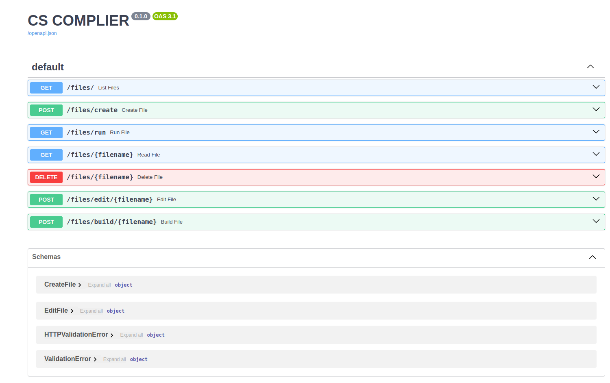

# Backend Compiler

**Nên tạo dự án cho riêng mình và ghi vào CV nha theo từng bước + mở rộng thêm**

## 1. 🚀 CS Compiler

Dự án này triển khai một trình biên dịch (compiler) cho **ngôn ngữ CS**, được phát triển dựa trên bài tập lớn trong môn PPL1.

**Compiler sẽ:**
- 📥 Đọc file nguồn .cs
- ⚙️ Biên dịch thành bytecode .class
- ▶️ Chạy chương trình bằng Java Virtual Machine (JVM)

**🧱 Kiến trúc tổng quan**
```
.cs source code
      ↓
  Compiler (Python)
      ↓
 .class (Java bytecode)
      ↓
     JVM (java)
      ↓
   Output
```

**📝 Ví dụ chương trình CS**
```
// ------------ Program --------------
const a = 2;
const b = 3 + a;
print(a + b);
// ------------------------------------
```

**▶️ Cách chạy**
```
➜  compiler# python3 run.py main.cs 
/Backend/compiler/src/runtime
Compile success
➜  compiler# (cd src/runtime && java CS)            
7
```

---

## 2. 🚀 CS Compiler Backend API

**Backend cung cấp API để:**
- Quản lý file source code
- Biên dịch (build) chương trình
- Chạy chương trình
- Chỉnh sửa nội dung file

**📂 API Endpoints**
* `GET /files/` → Lấy danh sách file
* `POST /files/create` → Tạo file mới
* `GET /files/run` → Chạy chương trình
* `GET /files/{filename}` → Đọc file
* `DELETE /files/{filename}` → Xóa file
* `POST /files/edit/{filename}` → Sửa nội dung file
* `POST /files/build/{filename}` → Build (compile) file



Dưới đây là phiên bản README **ngắn gọn, rõ ràng** cho phần Docker + CI/CD:

---

## 3. 🚀 Docker & CI/CD

### 🐳 Docker

**Chạy bằng Docker Compose**

```bash
docker compose up --build test
```

---

### 📦 Dockerfile

* Base image: `python:3.11-slim`
* Cài thêm:

  * `openjdk-21`
  * `build-essential`
* Cài dependencies từ `requirements.txt`
* Run app bằng:

```bash
python run.py
```

---

### 🔄 CI/CD (GitHub Actions)

* Trigger khi push vào branch `main`
* Tự động:

  1. Checkout code
  2. Build Docker
  3. Run test (`pytest`)

```yaml
docker compose build
docker compose run --rm test
```


<p align="center">
  <a href="https://www.facebook.com/Shiba.Vo.Tien">
    
  </a>
  <a href="https://www.tiktok.com/@votien_shiba">
    
  </a>
  <a href="https://www.facebook.com/groups/khmt.ktmt.cse.bku?locale=vi_VN">
    
  </a>
  <a href="https://www.facebook.com/CODE.MT.BK">
    
  </a>
  <a href="https://github.com/VoTienBKU">
    
  </a>
</p>